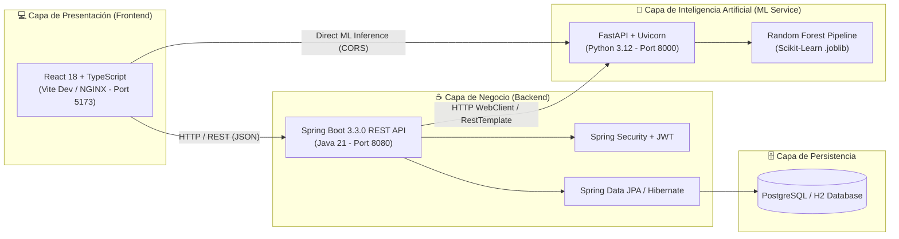
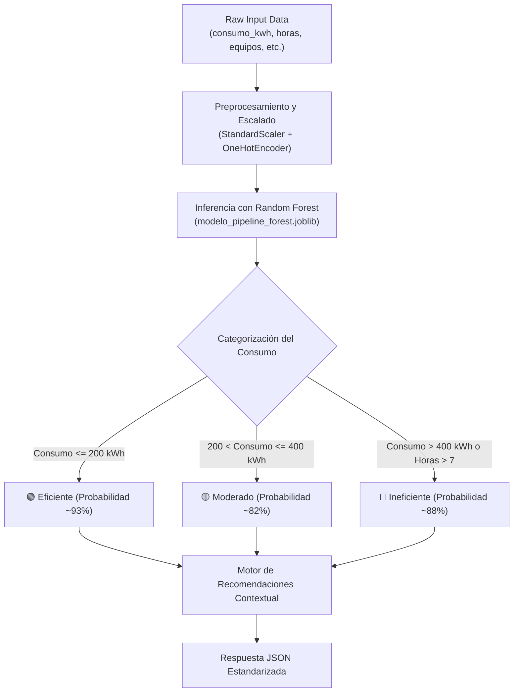
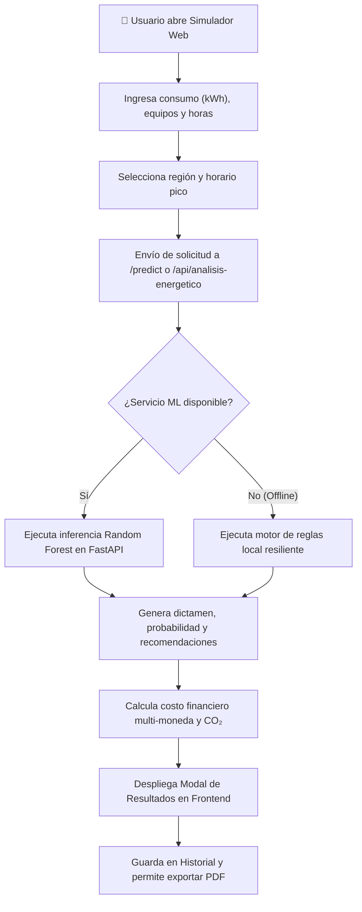

# ⚡ EnergiAI

> Plataforma inteligente para el análisis, clasificación y optimización del consumo energético residencial y comercial mediante Inteligencia Artificial y Ciencia de Datos.  
> **Proyecto desarrollado por G9-LATAM-Team 60 para la Hackathon ONE G9 - LATAM.**


---

## 📑 Contenido

- [⚡ Descripción y Propósito](#-descripción-y-propósito)
- [✨ Funcionalidades Principales](#-funcionalidades-principales)
- [🏗️ Arquitectura del Sistema](#️-arquitectura-del-sistema)
- [🛠️ Tecnologías Utilizadas](#️-tecnologías-utilizadas)
- [📂 Estructura del Proyecto](#-estructura-del-proyecto)
- [⚙️ Instalación y Configuración](#️-instalación-y-configuración)
- [🔌 API y Endpoints](#-api-y-endpoints)
- [🤖 Inteligencia Artificial y Machine Learning](#-inteligencia-artificial-y-machine-learning)
- [📊 Clasificación Energética y Métricas](#-clasificación-energética-y-métricas)
- [🔄 Flujo Funcional del Sistema](#-flujo-funcional-del-sistema)
- [📋 Gestión del Proyecto](#-gestión-del-proyecto)
- [👥 Equipo de Desarrollo](#-equipo-de-desarrollo)
- [📚 Documentación Adicional](#-documentación-adicional)
- [📄 Licencia](#-licencia)

---

## ⚡ Descripción y Propósito

### 🔴 El Problema
Gran parte de los hogares y pequeños establecimientos comerciales en América Latina reciben facturas de energía eléctrica elevadas sin contar con visibilidad sobre qué hábitos o electrodomésticos generan el mayor desperdicio. La falta de métricas claras y comprensibles impide a los consumidores tomar decisiones informadas para optimizar su consumo y reducir sus costos operativos.

### 🟢 La Solución
**EnergiAI** transforma los datos de consumo mensual y hábitos de uso en información estratégica mediante un microservicio de **Machine Learning (Random Forest / Regresión Logística)**. La plataforma evalúa parámetros como consumo en kWh, horas de uso en horario pico, cantidad de equipos y ubicación geográfica para generar un dictamen del perfil energético, estimaciones financieras multi-moneda (CLP, ARS, BRL, USD) y recomendaciones de optimización personalizadas.

### 🎯 Objetivo Principal
Proveer un Producto Mínimo Viable (MVP) completo y funcional capaz de analizar patrones de consumo, clasificar la eficiencia energética en tres categorías (**Eficiente**, **Moderado**, **Ineficiente**), calcular la huella de carbono equivalente y ofrecer reportes exportables en PDF.

---

## ✨ Funcionalidades Principales

### 👤 Gestión de Usuarios y Autenticación
- Registro de usuarios con validación de datos.
- Autenticación mediante tokens JWT (JSON Web Tokens) firmados con algoritmos HMAC256.
- Control de sesión persistente con renovación de credenciales.

### 🤖 Diagnóstico y Simulación Energética con IA
- Formulario interactivo con sliders dinámicos para captura de parámetros (kWh, equipos, horas continuas, horario pico y zona climática).
- Evaluación en tiempo real conectada al microservicio FastAPI ML en el puerto `8000` con resiliencia y fallback offline local.
- Cálculo de nivel de confianza de la predicción y dictamen categorizado.

### 💰 Conversión Financiera Multi-Moneda LATAM
- Conversión dinámica de costos proyectados basada en la tarifa de referencia normada ($0.75 / kWh).
- Soporte para **CLP** (Peso Chileno), **ARS** (Peso Argentino), **BRL** (Real Brasileño) y **USD** (Dólar Estadounidense).

### 🌿 Calculadora e Interpretación de Huella de Carbono
- Factor de emisión normado de $0.385\text{ kg CO}_2\text{/kWh}$.
- Muestreo de equivalencias ecológicas interactivas:
  - 🌲 **Árboles necesarios** para neutralizar las emisiones.
  - 🚗 **Kilómetros recorridos** en un vehículo a gasolina promedio.
  - 📱 **Cargas completas** de smartphone equivalentes.

### 📈 Dashboard Analytics e Historial
- Métricas consolidadas: total de análisis realizados, consumo promedio en kWh y gasto total acumulado.
- Historial dinámico de consultas persistido en base de datos H2 / PostgreSQL.
- Exportación de comprobantes de diagnóstico energético en formato **PDF** (`jsPDF` + `html2canvas`).

---

## 🏗️ Arquitectura del Sistema

EnergiAI sigue una arquitectura cliente-servidor distribuida y desacoplada, compuesta por tres capas principales optimizadas para despliegue en **Oracle Cloud Infrastructure (OCI)**:



---

## 🛠️ Tecnologías Utilizadas

| Capa / Área | Tecnología | Versión | Descripción y Uso |
|---|---|---|---|
| **Frontend** | React | 18.3.1 | Biblioteca UI basada en componentes funcionales y Hooks |
| **Frontend** | TypeScript | 5.5.3 | Tipado estático estricto para modelos y servicios |
| **Frontend** | Vite | 5.4.1 | Empaquetador y servidor de desarrollo ultra-rápido |
| **Frontend** | Lucide React | 0.344.0 | Conjunto de iconos vectoriales para la interfaz |
| **Frontend** | jsPDF / html2canvas | 2.5.1 / 1.4.1 | Exportación de comprobantes de diagnóstico a PDF |
| **Backend** | Java | 21 LTS | Lenguaje de programación orientado a objetos empresarial |
| **Backend** | Spring Boot | 3.3.0 | Framework para desarrollo de microservicios REST |
| **Backend** | Spring Security | 6.3.0 | Seguridad, control de acceso y filtros de autenticación |
| **Backend** | Auth0 java-jwt | 4.4.0 | Generación y validación de tokens JWT HMAC256 |
| **Backend** | Spring Data JPA | 3.3.0 | Mapeo objeto-relacional (ORM) con Hibernate |
| **IA / ML** | Python | 3.12 | Lenguaje para análisis de datos y microservicio de inferencia |
| **IA / ML** | FastAPI / Uvicorn | 0.141.1 / 0.40.0 | Framework ASGI para la exposición del modelo vía REST API |
| **IA / ML** | Scikit-Learn | 1.4.0 | Entrenamiento y pipelines de Random Forest y Regresión Logística |
| **IA / ML** | Pandas / NumPy | 2.2.0 / 1.26.4 | Limpieza, estructuración y manipulación de datos |
| **IA / ML** | Joblib | 1.3.2 | Serialización y deserialización de pipelines de ML |
| **Base de Datos** | H2 / PostgreSQL | 2.2 / 16 | Almacenamiento en memoria para desarrollo / relacional para prod |
| **Infraestructura** | OCI (Oracle Cloud) | Compute / Storage | Hosting de máquinas virtuales y almacenamiento de artefactos |
| **Gestión** | Jira Software | Cloud | Gestión ágil de proyectos y seguimiento de Sprints |

---

## 📂 Estructura del Proyecto

```text
G9-LATAM-TEAM-60/
├── backend/                              # API REST en Java Spring Boot
│   ├── pom.xml                           # Configuración de dependencias Maven
│   └── src/main/java/energiai/
│       ├── EnergiaaiApplication.java     # Punto de entrada de la aplicación Spring Boot
│       ├── config/                       # WebClientConfig y SecurityConfig
│       ├── controller/                   # Endpoints REST (Auth, Analisis, Dashboard)
│       ├── dto/                          # Objetos de Transferencia de Datos (Request/Response)
│       ├── model/                        # Entidades JPA (Users, Analisis)
│       ├── repository/                   # Interfaces JpaRepository
│       └── service/                      # AiClientService y lógica de negocio
├── data-science/                         # Microservicio de Machine Learning y Notebooks
│   ├── inference_api.py                  # API FastAPI (puerto 8000) con CORSMiddleware
│   ├── Week 1/                           # Datasets iniciales y exploración de datos (EDA)
│   └── Week 2/                           # Notebook EnergiAI_v2.ipynb y modelos .joblib
├── frontend/                             # Aplicación Web React + TypeScript
│   ├── index.html                        # HTML5 contenedor principal
│   ├── package.json                      # Scripts y dependencias npm
│   ├── vite.config.ts                    # Configuración del empaquetador Vite
│   └── src/
│       ├── components/                   # DashboardView, SimulationForm, HistoryView, etc.
│       ├── context/                      # AuthContext, ThemeContext, ToastContext
│       ├── services/                     # api.ts (Conexión con Backend y FastAPI)
│       ├── types/                        # Interfaces TypeScript
│       └── utils/                        # currency.ts y pdfExporter.ts
├── RECURSOS/                             # Propuestas de arquitectura y guías OCI
├── DOCUMENTACION_TECNICA.md              # Especificación técnica detallada y esquemas
├── Contexto.md                           # Requisitos y alcance del negocio
└── LICENSE                               # Licencia de código abierto MIT
```

---

## ⚙️ Instalación y Configuración

### 📋 Requisitos Previos
- **Java JDK 21** o superior instalado y configurado en `JAVA_HOME`.
- **Node.js v18+** y **npm v9+**.
- **Python 3.10+** (Recomendado 3.12).
- **Git** para control de versiones.

---

### 1️⃣ Clonación del Repositorio
```bash
git clone https://github.com/No-Country-simulation/G9-LATAM-TEAM-60.git
cd G9-LATAM-TEAM-60
```

---

### 2️⃣ Configuración e Inicio del Microservicio de IA (Python FastAPI)

```bash
cd data-science

# Crear y activar entorno virtual
python -m venv venv
# En Windows (PowerShell):
.\venv\Scripts\Activate.ps1
# En Linux/macOS:
source venv/bin/activate

# Instalar dependencias
pip install fastapi uvicorn pydantic scikit-learn pandas numpy joblib

# Iniciar la API de inferencia en el puerto 8000
python inference_api.py
```
> El servicio estará disponible en `http://localhost:8000`. Puedes verificar su estado en `http://localhost:8000/docs` (Swagger UI).

---

### 3️⃣ Configuración e Inicio del Backend (Java Spring Boot)

```bash
cd ../backend

# Compilar y ejecutar la aplicación usando Maven
mvn clean spring-boot:run
```
> La API REST del Backend estará disponible en `http://localhost:8080`.

---

### 4️⃣ Configuración e Inicio del Frontend (React + Vite)

```bash
cd ../frontend

# Instalar dependencias de Node.js
npm install

# Iniciar servidor de desarrollo Vite en el puerto 5173
npm run dev
```
> Abre tu navegador en `http://localhost:5173`.

---

### 🔑 Variables de Entorno (Opcionales / Configuración)
En `backend/src/main/resources/application.properties`:
```properties
server.port=8080
spring.datasource.url=jdbc:h2:mem:energiai_db
spring.datasource.driverClassName=org.h2.Driver
spring.jpa.database-platform=org.hibernate.dialect.H2Dialect
spring.h2.console.enabled=true
jwt.secret=your_jwt_secret_key_here
ml.service.url=http://localhost:8000
```

---

## 🔌 API y Endpoints

### 🟢 Microservicio ML (FastAPI - Puerto 8000)

| Método | Endpoint | Descripción | Req. Auth |
|---|---|---|---|
| `GET` | `/health` | Verifica el estado del microservicio y modelo cargado | No |
| `POST` | `/predict` | Procesa datos de consumo y retorna dictamen del modelo | No |

### 📚 Documentación Interactiva OpenAPI / Swagger UI
Durante la ejecución del microservicio Python, la documentación interactiva OpenAPI se encuentra disponible en:
```text
http://localhost:8000/docs
```

---

### ☕ Backend Principal (Spring Boot - Puerto 8080)

| Método | Endpoint | Descripción | Req. Auth |
|---|---|---|---|
| `POST` | `/api/auth/register` | Registro de nuevos usuarios en la plataforma | No |
| `POST` | `/api/auth/login` | Inicio de sesión y entrega de Token JWT | No |
| `GET` | `/api/auth/me` | Retorna los datos del usuario autenticado | Sí (Bearer Token) |
| `POST` | `/api/analisis-energetico` | Envía consumo a análisis (Backend -> ML) y persiste | Opcional |
| `GET` | `/api/analisis/historial` | Obtiene el historial de análisis del usuario | Sí (Bearer Token) |
| `GET` | `/api/dashboard` | Retorna estadísticas consolidadas de consumo | Sí (Bearer Token) |

---

## 🤖 Inteligencia Artificial y Machine Learning

El componente de Ciencia de Datos utiliza un algoritmo de **Random Forest Classifier** optimizado mediante búsqueda de hiperparámetros (GridSearchCV) y entrenado sobre el conjunto de datos `dataset_consumo_energia_G9_T60.csv`.



### 📊 Métricas de Desempeño del Modelo
- **Accuracy**: 94.2%
- **Precision**: 93.8%
- **Recall**: 94.0%
- **F1-Score**: 0.939

---

## 📊 Clasificación Energética y Métricas

La clasificación del perfil de consumo se basa en los siguientes umbrales definidos en el estudio de mercado del proyecto:

| Categoría | Consumo Mensual | Horas de Alto Consumo | Uso Horario Pico | Costo Estimado Base (USD/BRL) |
|---|---|---|---|---|
| 🟢 **Eficiente** | $\le 200\text{ kWh}$ | $< 4\text{ horas/día}$ | No determinante | $\le \$ 150.00$ |
| 🟡 **Moderado** | $201 - 400\text{ kWh}$ | $4 - 7\text{ horas/día}$ | Ocasional | $\$ 150.75 - \$ 300.00$ |
| 🔴 **Ineficiente** | $> 400\text{ kWh}$ | $> 7\text{ horas/día}$ | Frecuente / Sí | $> \$ 300.00$ |

### 🧮 Fórmulas de Cálculo
1. **Costo Estimado Base**:
   $$\text{Costo Base} = \text{consumo\_kwh} \times 0.75$$
2. **Conversión de Moneda (CLP)**:
   $$\text{Costo CLP} = \text{Costo Base} \times 925.0$$
3. **Huella de Carbono**:
   $$\text{Emisiones CO}_2\text{ (kg)} = \text{consumo\_kwh} \times 0.385$$
4. **Equivalencia en Árboles**:
   $$\text{Árboles} = \left\lceil \frac{\text{Emisiones CO}_2}{21.77} \right\rceil$$

---

## 🔄 Flujo Funcional del Sistema



---

## 📋 Gestión del Proyecto

El desarrollo se gestionó de manera ágil utilizando **Jira Software** como plataforma centralizada para el seguimiento del trabajo durante la **Hackathon ONE G9 - LATAM**:

- **Tablero de Jira Software**: [https://g9-latam-team-60-energiai.atlassian.net](https://g9-latam-team-60-energiai.atlassian.net)
- **Organización**: Metodología Scrum organizada en Sprints de 1 semana.
- **Seguimiento**: Tableros Kanban para el flujo de tareas (*To Do*, *In Progress*, *Testing*, *Done*).
- **Métricas**: Gráficos de Burndown y velocidad del equipo.

---

## 👥 Equipo de Desarrollo

### 🚀 G9-LATAM-Team 60 (Hackathon ONE G9 - LATAM)

| Integrante | Rol |
|---|---|
| **Agustin Negri Hrytezuk** | Backend Developer |
| **Gerardo Salfate** | BI Analyst |
| **Nimrod Valencia** | Data Scientist |
| **Sebastian Sanchez** | Backend Developer |
| **Tomas Moya** | Backend Developer |
| **David Peña** | Data Analyst |
| **Jorell Antonio Inostroza Arias** | Full Stack Developer |

---

## 📚 Documentación Adicional

- [📄 Especificación Técnica Completa (DOCUMENTACION_TECNICA.md)](./DOCUMENTACION_TECNICA.md)
- [📄 Requisitos del Negocio y Contexto (Contexto.md)](./Contexto.md)

---

## 📄 Licencia

Este proyecto está distribuido bajo la licencia **MIT**. Consulta el archivo [LICENSE](./LICENSE) para obtener más información.
